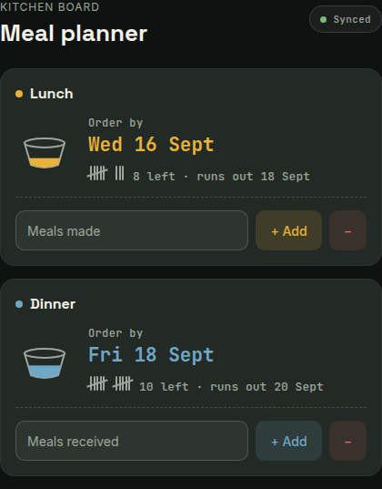
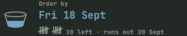
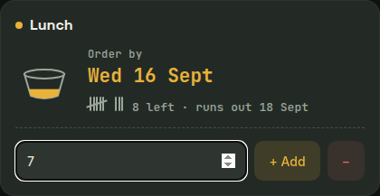

# 🐶 Meal Planner

A little kitchen-board-styled web app for tracking a dog's meals and working out the **latest date to order or prep more food**, so a defrost never gets missed.

Tracks lunch and dinner as two independent counts, each with its own order-by date, run-out date, and advance-warning reminders.



---

## 🚀 Features

- **Separate lunch and dinner tracking** — different batch sizes, different schedules, tracked independently
- **Add / Remove, not overwrite** — log a new batch ("just made 15 lunches") without losing the running count, and remove meals lost to spoilage or waste without disturbing the rest
- **Auto-decrement** — each count quietly ticks down right at that meal's set time (not midnight), so it stays accurate even if the app isn't opened every day, and stays honest about whether today's meal has actually happened yet
- **Bowl-fill visual** — each meal type shows as a bowl that fills up relative to a full batch, for an at-a-glance read on stock level
- **Chalk tally counter** — the exact count, grouped in fives like a tally on a kitchen board
- **UK holiday and weekend aware** — order-by dates roll back automatically to the nearest working day, using live data from [gov.uk](https://www.gov.uk/bank-holidays.json)
- **Two-stage reminders** — a heads-up 7 days before the order-by date, and a second one at 5 days, so a low count doesn't get missed



---

## 🛠️ Tech stack

- **HTML5**
- **CSS3** — custom chalkboard theme, mobile-first
- **JavaScript (vanilla)** — no build step, no framework
- **Space Grotesk / Inter / JetBrains Mono** via Google Fonts

---

## 📂 Project structure

```
/ (root)
│
├── index.html      # Markup for the lunch and dinner cards
├── style.css        # Chalkboard theme, layout, responsive rules
└── script.js         # State, calculations, rendering, notifications
```

---

## 📖 How to use

1. Open `index.html` in a browser (or, once installed as an app, tap the icon on your phone).
2. When you cook a fresh batch, enter how many meals you made and hit **+ Add** — it tops up the existing count rather than replacing it.
3. If any meals spoil or get wasted, enter the amount and hit **Remove**.
4. Each card shows:
   - The bowl-fill level for that meal type
   - The tally count of meals remaining, and the date it'll run out
   - The **order-by date**, adjusted for weekends and UK bank holidays



---

## 🥣 Tuning the bowl-fill visual

`FULL_BOWL_MEALS` at the top of `script.js` sets what counts as a completely full bowl:

```js
const FULL_BOWL_MEALS = 18;
```

Anything at or above this shows as full; the fill level scales linearly below it. Change this one number if a "full batch" looks different for your setup.

---

## ⏰ Meal times

`MEAL_TIMES` at the top of `script.js` sets what hour each meal is actually fed:

```js
const MEAL_TIMES = {
  lunch: 13,
  dinner: 18,
};
```

The remaining count only decrements once that hour passes each day, rather than at midnight — so checking in the morning shows the pre-meal total, and it drops right after the meal's actually happened. Uses 24-hour local time (`13` = 1pm, `18` = 6pm). Change these if feeding times shift.

---

## 🔔 Notifications

Two reminders are scheduled per meal type: one **7 days** before the order-by date, and one **5 days** before. Notification permission is requested automatically on startup when running as a native app.

Right now, in a plain browser, this is wired up but inactive — browsers can't reliably wake themselves up on a future date once closed or the phone's asleep. Notifications only start actually firing once the app is wrapped with [Capacitor](https://capacitorjs.com/) and its `LocalNotifications` plugin, which schedules through the OS itself rather than the browser. That wrap is the natural next step for this project — see Roadmap below.

---

## 🌍 Region support

Currently defaults to **England & Wales** for bank holidays. To switch region, update this line in `script.js`:

```js
const events = data['england-and-wales'].events;
```

Replace `'england-and-wales'` with `'scotland'` or `'northern-ireland'`.

---

## 🗺️ Roadmap

- [x] Wire up `LocalNotifications` scheduling and permission request (active once wrapped with Capacitor)
- [x] Handle Android Doze mode via `allowWhileIdle` on scheduled notifications
- [ ] Wrap the app with Capacitor for a real installable Android app
- [ ] Reschedule notifications on device reboot (native boot-completed receiver)

---

## ✅ Example

If lunch (fed at 1pm) has **6 meals left** and it's currently 10am, today's lunch hasn't happened yet:

- Runs out on: **today + 5 days** (today's still-pending meal counts as day one of the countdown)
- Latest order date: **2 days before that**, rolled back if it lands on a weekend or bank holiday
- Reminders fire 7 and 5 days ahead of that order date (once notifications are live)

Once 1pm passes and the count auto-drops to 5, the same run-out date still holds — checking before or after the meal always gives a consistent answer.

---

## 🐾 License

Free to use and modify for personal use.
